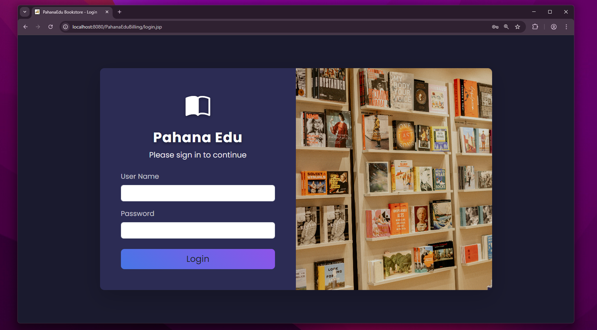
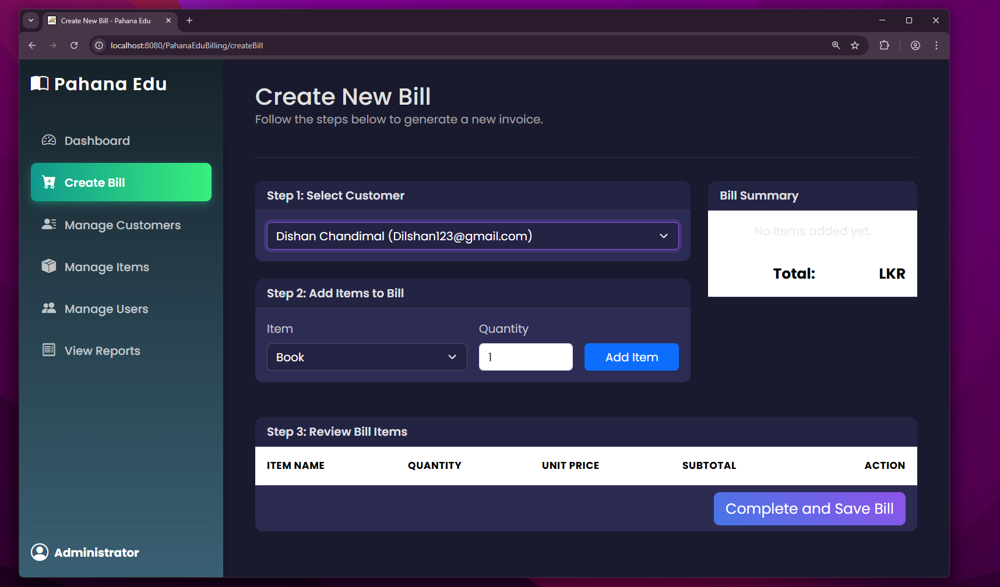
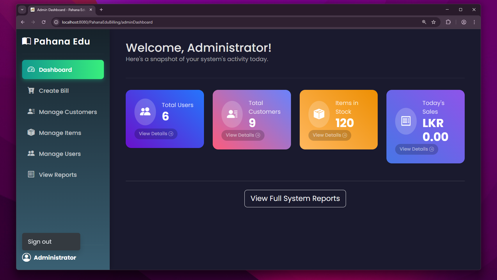

# Pahana Edu Billing System

[](https://github.com/ChamithRajapaksha/pahana-edu-billing-system/actions/workflows/ci.yml)
[](https://github.com/ChamithRajapaksha/pahana-edu-billing-system/releases)


[](#license)

A **3‑tier** Java web app for a bookstore’s POS and admin operations: secure auth, customer & item management, transactional billing, and a small REST API.

> This README is formatted in **Markdown**. Make sure the filename is exactly `README.md` in the **root** of the repo.

---

## Screenshots

> Put images in `docs/images/` before using these links.

**Login**  


**Create Bill**  


**Admin Dashboard**  


---

## Features

- **Authentication & Roles:** Admin/Cashier with password hashing; guards `/admin/*`
- **Customers & Items:** Full CRUD with validation
- **Billing:** Multi‑item invoice, taxes/discounts, **atomic** DB transaction, stock checks
- **Reports:** Daily sales, top items, inventory snapshot
- **REST API:** `/api/v1/*` for integrations

---

## Architecture

- **Presentation:** JSP + Servlets (security filter for `/admin/*`)
- **Service:** Business rules (auth, billing totals, stock enforcement)
- **Persistence:** DAO layer (JDBC; connection pooling)
- **Patterns:** MVC, DAO, Singleton (DB connection), Front Controller variant
- **Transactions:** Billing is ACID‑safe; service layer validates stock

---

## Tech Stack

- Java 17 (compatible with 8)
- Apache Tomcat 9 (WAR deployment)
- MySQL 8 (H2/Testcontainers for tests)
- Maven build
- JUnit 5, Mockito, JaCoCo
- GitHub Actions CI

---

## Project Structure

```
pahana-edu-billing-system/
├─ src/
│  ├─ main/java/com/pahana/edu/...
│  ├─ main/resources/            # db.properties
│  └─ main/webapp/               # JSP, assets, WEB-INF
├─ docs/images/                  # login.png, create-bill.png, dashboard.png
├─ postman/                      # API collection
├─ .github/workflows/ci.yml
├─ pom.xml
└─ README.md
```

---

## Getting Started

### Prerequisites
- Java 17 (or 8), Maven 3.8+, MySQL 8, Tomcat 9

### Clone
```bash
git clone https://github.com/ChamithRajapaksha/pahana-edu-billing-system.git
cd pahana-edu-billing-system
```

### Configure DB
Create `src/main/resources/db.properties`:
```properties
db.url=jdbc:mysql://localhost:3306/pahanaedu?useSSL=false&serverTimezone=UTC
db.username=YOUR_USER
db.password=YOUR_PASSWORD
db.pool.size=10
```

### Build & Test
```bash
mvn clean verify
```
- JaCoCo report: `target/site/jacoco/index.html`

### Package & Deploy
```bash
mvn -DskipTests package
```
Copy `target/pahana-edu-billing-system.war` to Tomcat `webapps/` and start Tomcat.

---

## API Quick Start

Base: `http://localhost:8080/pahana-edu-billing-system/api/v1`

Create bill:
```bash
curl -X POST -H "Content-Type: application/json"   -H "X-API-KEY: YOUR_KEY"   -d @postman/sample-create-bill.json   http://localhost:8080/pahana-edu-billing-system/api/v1/bills
```

---

## Quality: CI, Coverage & Conventions

- **CI:** Builds, runs tests, uploads reports (GitHub Actions).
- **Coverage target:** ≥ 80% for services/DAO logic.
- **Conventional Commits:** `feat:`, `fix:`, `docs:`, `test:`, etc.

---

## Versioning, Branching & Releases

- Default branch: `main` (protected; PRs + green CI required)
- Features: `feature/<short-name>` → PR → merge
- Tags & Releases: `vX.Y.Z` with WAR attached

---

## Contributing

1. Create a feature branch from `main`
2. Add/Update tests
3. `mvn verify` all green
4. Open a PR using the template

---

## License

MIT — see `LICENSE`.
